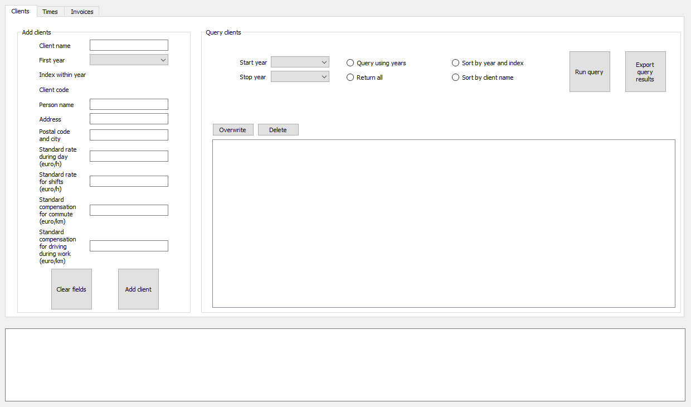
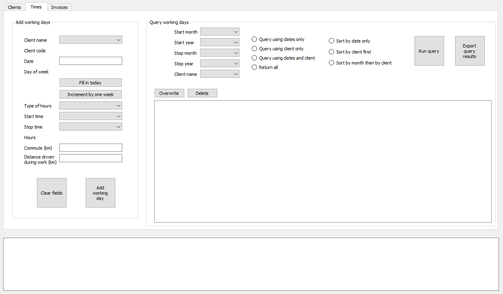
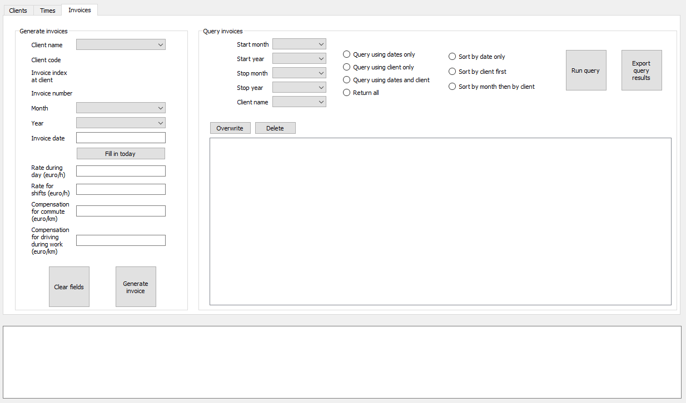

# A Simple Accounting Program
This is a simple local program to do the accounting of a small company or a freelancer. 

The main idea is that it gives output that is still completely usable without the program (through the use of .xlsx files)

The program is based on Qt for Python (pyside2) and uses two threads, a GUI main thread and a background thread.

There are three tabs.

The first "Clients" tab lets the user enter information about a client and query the clients entered before.

The second "Times" tab lets the user enter working days and query the working days entered before.

The third "Invoices" tab lets the user generate invoices from a supplied template.xlsx file and query the invoices generated before. Double-clicking on the invoice in the table opens the .xlsx file in its default application (e.g. Microsoft Excel or LibreOffice Calc). The rates and compensations are filled in by the program using the standard values from the client, but can be changed for each invoice individually.

In all three tabs, the query results can be exported. Also, individual clients, working days, or invoices can be overwritten or deleted.

A console window below the tabs gives messages regarding the success or failing of user actions. 

At the start of the program, all user-generated files are zipped and stored as a backup.

This program is written specifically for a freelancing family doctor. My idea is to at some point make a "Configurations" tab, in which it should be easy to adapt the program to specific needs.